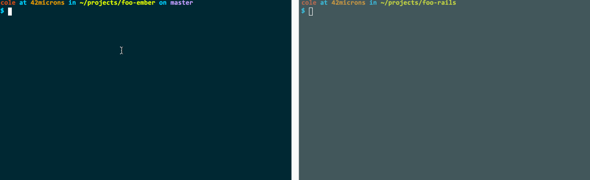

# g

Run CLI generator commands without paying attention to where you are or what you are really doing.

DO U EVER FIND YOURSELF IN THIS UNENVIABLE POSITION?

```
$ ember g model foo
version: 0.2.3
You have to be inside an ember-cli project in order to use the generate command.
```

HOW EMBARASSING!! g ENDS ALL OF THAT.



## Installation

Because somebody already has a gem named "g", you must:

    $ gem install geee

This will add `g` to yr path

## Usage

g accepts any and all arguments and/or options that ember generate or rails generate accept. For example, `g model foo` will just do the right thing depending on what kind of project you are currently in.

## Contributing

I'm not sure if frameworks besides rails and ember exist, but if they do you are welcome to adapt g to generate for them too.

1. Fork it ( https://github.com/coleww/geee/fork )
2. Create your feature branch (`git checkout -b my-new-feature`)
3. Commit your changes (`git commit -am 'Add some feature'`)
4. Push to the branch (`git push origin my-new-feature`)
5. Create a new Pull Request
